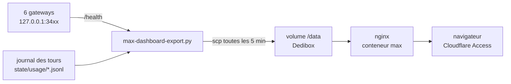

# max

Tableau de bord des gateways Claude Max : une page statique qui montre, pour
chaque variante du proxy local, si elle répond, ce qu'elle a consommé, et où en
est la fenêtre du forfait.

Servie par nginx sur `max.montaigu.org`. Même moule que
[`maison`](https://github.com/AlbanMontaigu/maison) — HTML/CSS/JS nu, aucune
étape de build, un conteneur, un volume.

## Les deux flux, et pourquoi c'est un push



Le mac n'est joignable de nulle part et Cloudflare Access garde toute la zone :
une API d'ingestion aurait demandé un jeton de service ou une règle de
contournement. Le mac **pousse** donc son état, et rien n'entre ici. Couper le
cron suffit à revenir en arrière — le conteneur continue de servir le dernier
payload, et la page dit son âge au lieu de faire semblant.

Corollaire : **cette page ne commande rien.** Pas de boutons, pas de proxy
`/api/`, aucun chemin vers la machine. Redémarrer une gateway depuis un
navigateur est un pouvoir qui se décide à part, pas un effet de bord d'un
tableau de bord.

## Les deux horloges, à ne jamais additionner

Le payload porte deux familles de chiffres, et les confondre serait la première
façon de mentir :

| Source | Ce qu'elle sait | Ce qu'elle oublie |
|---|---|---|
| `/health` de chaque variante | l'instant : vivante, file d'attente, session, fenêtre du forfait | tout, à chaque redémarrage — ses compteurs repartent de zéro |
| le journal des tours | la durée : une ligne par tour, tokens compris | rien, il est sur disque et purgé à 35 jours |

D'où le libellé « depuis le démarrage, il y a N » sur les compteurs de
`/health` : sans l'âge à côté, un `kickstart` de ce matin se lirait comme une
journée sans erreur.

Le journal est écrit par la gateway elle-même (`shared/usage_journal.py` dans
`claude-max-gateway`) : avant lui, les tokens n'existaient que dans une ligne de
log, dans un fichier qui se tronque tout seul à 5 Mo.

## Ce que la page ne sait pas

Les noms des variantes, leurs rôles, leurs ports, ce qui appartient à quel agent
— **rien de tout cela n'est dans ce dépôt**, qui est public. Tout arrive dans
`data.json`, construit côté mac. Si un libellé doit changer, il change dans
l'export, pas ici.

## Le payload

`GET /data.json` — poussé toutes les 5 min, jamais mis en cache.

```jsonc
{
  "generated_at": "2026-09-21T12:55:22+02:00",
  "window_days": 7,
  "variants": [{
    "id": "…", "label": "…", "role": "…", "owner": "openclaw|hermes",
    "port": 3457, "up": true, "error": null, "llm": true,
    "uptime_s": 3293, "queued": 0, "max_queued": 2,
    "turn_duration": { "p50": 7.9, "p95": 26.7 },
    "since_boot": { "turns": 29, "session_resumes": 0, "empty_turns": 0 },
    "anomalies": [{ "id": "errors", "label": "Erreurs", "count": 0 }],
    "rate_limit": { … }, "journal": { "written": 41, "dropped": 0, "errors": 0 }
  }],
  "plan": { "type": "five_hour", "utilization": 64.2, "resets_at": 1789983000,
            "source": "cron-full" },
  "series": { "hours": ["…"], "by_variant": { "full": [{ "turns": 3, "in": 1,
              "cache_read": 2, "cache_creation": 3, "out": 4 }] } },
  "models": [{ "id": "claude-sonnet-5", "turns": 2486, "out": 3200000 }],
  "journal": { "present": true, "bad_lines": 0, "entries": 4123 }
}
```

Les heures **vides existent et valent zéro** : une courbe qui saute les cases
vides fait ressembler un trou dans la collecte à une nuit calme.

## Deux échelles, deux dessins

Les tokens relus dans le cache pèsent dix à trente fois le reste. Empilés
ensemble, « produits par le modèle » devient un liseré d'un pixel — soit
exactement la grandeur qu'on vient chercher. La page trace donc deux
histogrammes, chacun avec son échelle, et le dit sous les dessins.

## Déploiement

Coolify sur la Dedibox, projet dédié, image construite depuis ce dépôt.

- Volume : répertoire hôte qui reçoit le payload → `/data` dans le conteneur.
- Domaine : `https://max.montaigu.org` (un seul niveau, couvert par l'Universal
  SSL de Cloudflare ; Access garde la zone, donc la page est privée).
- **Pousser sur `main` ne déploie pas** : il n'y a aucun webhook. Le
  déploiement se déclenche à la main (`POST /api/v1/deploy?uuid=…`).
- Contrôle qui ne ment pas : `md5sum` de `js/app.js` **dans le conteneur**
  contre le fichier local, pas le `Up N minutes` de `docker ps`.

## Travailler dessus

```sh
python3 ~/.openclaw/scripts/max-dashboard-export.py --out sample/data.json
cp sample/data.json frontend/data.json
cd frontend && python3 -m http.server 8899
```

Il n'y a pas de suite de tests. On vérifie en construisant l'image (le
Dockerfile échoue si le cache-busting n'a pas eu lieu) et en **rendant la page
dans un navigateur** — un défaut de mise en page ne se voit pas en relisant du
CSS.
